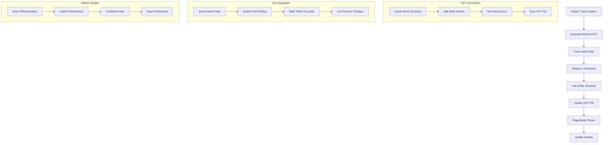

# Kaitai Struct Integration Plan

## Overview
This plan outlines the integration of Kaitai Struct-based packet parsing into the fuzzer tool. The goal is to enhance packet structure definition and analysis by leveraging Kaitai Struct's powerful parsing capabilities while maintaining compatibility with existing marker functionality.

## System Architecture



## Components

### 1. KSY File Management

The KsyManager class will handle all operations related to .ksy files:

```python
class KsyManager:
    def __init__(self):
        self.ksy_dir = "ksy_definitions/"  # Directory for .ksy files
        self.compiler = KaitaiStructCompiler()
        
    def create_minimal_ksy(self, packet_type: str, initial_data: bytes) -> str:
        """Create minimal KSY file for a new packet type"""
        ksy_content = {
            "meta": {
                "id": f"{packet_type}_packet",
                "title": f"{packet_type} Packet Structure",
                "fuzzable_fields": []  # List of field paths that are fuzzable
            },
            "seq": [
                {
                    "id": "header",
                    "type": "u4",
                    "doc": "Packet header"
                },
                {
                    "id": "payload",
                    "size-eos": True,
                    "doc": "Packet payload"
                }
            ]
        }
        return ksy_content

    def compile_ksy(self, ksy_path: str) -> None:
        """Compile KSY to Python class"""
        pass

    def update_ksy(self, ksy_path: str, updates: dict) -> None:
        """Update existing KSY file with new definitions"""
        pass
```

### 2. PacketTypeManager Integration

Extended PacketTypeManager to support Kaitai Struct integration:

```python
class PacketTypeManager:
    def create_type(self, name: str, description: str, criteria: PacketTypeCriteria) -> bool:
        """Extended to generate KSY file"""
        if super().create_type(name, description, criteria):
            # Create minimal KSY file
            ksy_manager = KsyManager()
            ksy_content = ksy_manager.create_minimal_ksy(name, sample_data)
            ksy_path = f"ksy_definitions/{name}_packet.ksy"
            
            with open(ksy_path, "w") as f:
                yaml.dump(ksy_content, f)
                
            # Compile KSY to Python
            ksy_manager.compile_ksy(ksy_path)
            return True
        return False
```

### 3. Enhanced MarkerManager

MarkerManager updates to support Kaitai-based markers:

```python
class MarkerManager:
    def add_kaitai_marker(self, packet_type: str, field_path: str, is_fuzzable: bool = False) -> None:
        """Add a Kaitai-based marker"""
        ksy_path = f"ksy_definitions/{packet_type}_packet.ksy"
        
        with open(ksy_path) as f:
            ksy_data = yaml.safe_load(f)
            
        if is_fuzzable:
            if "fuzzable_fields" not in ksy_data["meta"]:
                ksy_data["meta"]["fuzzable_fields"] = []
            ksy_data["meta"]["fuzzable_fields"].append(field_path)
            
        with open(ksy_path, "w") as f:
            yaml.dump(ksy_data, f)
```

### 4. GUI Updates

HexdumpWidget enhancements for Kaitai integration:

```python
class HexdumpWidget:
    def __init__(self):
        self.kaitai_overlay = KaitaiOverlay()
        # ... existing init code ...

    def show_kaitai_fields(self):
        """Display Kaitai-parsed fields as overlay"""
        if self.current_packet_type:
            parser = self.get_kaitai_parser(self.current_packet_type)
            parsed = parser.from_bytes(self.data)
            self.kaitai_overlay.update(parsed)
            
    def on_field_right_click(self, field_path: str):
        """Handle right-click on Kaitai field"""
        menu = [
            "Mark as Fuzzable",
            "Edit Field Definition",
            "Remove Field",
            "Add New Field"
        ]
        # Show context menu
```

### 5. KaitaiOverlay Class

New class for visualizing Kaitai-parsed fields:

```python
class KaitaiOverlay:
    """Manages visual overlay of Kaitai-parsed fields"""
    def __init__(self):
        self.fields = []  # List of (start, end, field_path, properties)
        
    def update(self, parsed_data):
        """Update overlay with newly parsed data"""
        self.fields = self._extract_fields(parsed_data)
        
    def render(self, canvas):
        """Render field overlays on hexdump"""
        for start, end, path, props in self.fields:
            self._draw_field(canvas, start, end, path, props)
```

## Implementation Steps

1. Set up Kaitai Struct environment
   - Install kaitai-struct-compiler
   - Add Python runtime dependencies
   - Create ksy_definitions directory

2. Implement KsyManager
   - Basic KSY file generation
   - Compilation to Python classes
   - KSY file updating mechanism

3. Update PacketTypeManager
   - Integrate KSY generation on new packet type creation
   - Link packet types to KSY definitions

4. Enhance MarkerManager
   - Add Kaitai-based marker support
   - Implement fuzzable field tracking
   - Maintain backward compatibility

5. Update GUI
   - Add Kaitai field visualization
   - Implement field editing interface
   - Add context menus for field operations

6. Testing
   - Unit tests for KSY generation
   - Integration tests for parser generation
   - GUI testing for field visualization
   - Fuzzing tests with new markers

## Dependencies

- kaitai-struct-compiler
- kaitai-struct-python-runtime
- PyYAML
- DearPyGui (existing)

## Notes

- Maintain backward compatibility with existing marker system
- Consider performance implications of live parsing
- Plan for error handling in parser generation
- Document KSY file format for users